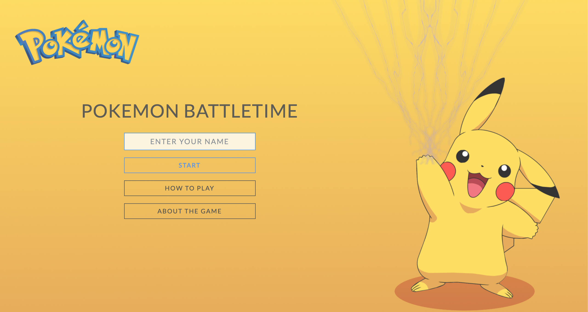
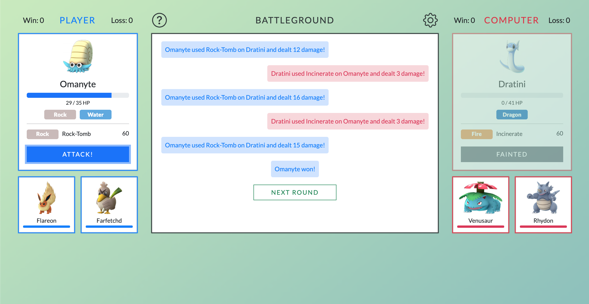

# rhine1217.github.io

# Projects

## **[Pokemon Battle Game](https://rhine1217.github.io/pokemon-battle-game/)**

- [**Summary**](#summary)
- [**Technologies Used**](#technologies-used)
- [**Approach**](#approach)
- [**Challenges**](#challenges)
- [**Future Features**](#future-features)
- [**Snapshots**](#snapshots)
- [**Credits**](#credits)

### **Summary**

A turn-based Pokemon browser game that allows players to launch attacks from their Pokemons against computer Pokemons while considering type effectiveness in their attack strategy.  

### **Technologies Used**

* Languages: HTML, CSS, JavaScript
* Framework: Bootstrap, jQuery
* API: https://pokeapi.co/

### **Approach**

**Made various PokeAPI calls to get the following information for game setup:**

1. Basic Pokemon stats for randomly generated list of Pokemons (assigned to the player and computer), including `name`, `hp`, `types`, `attack`, `defense` (from https://pokeapi.co/api/v2/pokemon/{id}/)
2. Additional PokeAPI calls to assign one attack move (with type and power stats) to each generated Pokemon. Calls made recursively as certain moves available to Pokemons are not attack moves (i.e. power is `null`) (from https://pokeapi.co/api/v2/move/{id}/)
3. Type information to compile an type effectiveness chart (i.e. which types are super effective, normal, not very effective, against which other types) (from https://pokeapi.co/api/v2/type/{id}/)

**Implemented a `Pokemon` class** to keep track of Pokemon stats throughout the course of the game after each attack arounds.

**Developed a damage calculation formula** that is a simplified version of the combination between the original Pokemon games and Pokemon Go. 

<em>Damage calculation formula details</em>

> Damage = 0.1 * Power * Attack / Defense * Modifier + 1
> * Power = Power of the move of the attacking Pokemon
> * Attack = Attack of the attacking Pokemon
> * Defense = Defense of the defending Pokemon
> * Modifier = Random * STAB * TypeEffectiveness
>    * Random = Random integer percentage between 0.85 and 1.00 (inclusive) 
>    * STAB = Same Type Attack Bonus;  1.25 if Move type matches attacking Pokemon's type; else = 1 
>    * TypeEffectiveness = Move (attacking Pokemon) type effectiveness against defending Pokemon's types 

**Built the browser front end (single page application)** with Pokemon stats and information rendered in Large (i.e. active) and Small (i.e. inactive) card formats that allow users to toggle active Pokemons by clicking on the small cards, and launch attacks with the `Attack!` button.

### **Challenges**
* **Sequencing the asynchronous PokeAPI calls appropriately** such that the the subsequent callbacks are executed in the right order 

* **Writing recursive API calls to ensure the Pokemon moves randomly assigned have the `power` stats.** Initially I was getting `null` on the `power` stats of Pokemon moves and thought something was wrong with the API calls or the asynchronity of them. Later I realized the `null` was due to the fact that there are two types of Pokemon moves: status, and physical. Status moves do not have `power` stats. 

* **Devising a reasonable damage calculation formula.**
    
    The formula needs to be designed in a way such that the rounds between the player and the computer are meaningful. That is, the game is not over too quickly or too slowly; and calculated results are within reasonable expectation considering relative Pokemon stats and types). The final formula considered the stats being collected and took a few trial and errors.

* **Deciding on the game mechanism.** 
    
    I considered a few options including 1) turn-based to launch one round of attack per click; 2) computer launching continuous, interval-based attacks while the player is required to keep clicking the screen. Current version used option 1 given its simplicity and that it sufficiently provides the game with the strategic component of choosing Pokemon based on types. 

### **Future Features**
* **Assign each Pokemon mutliple moves** (currently just one) and allow players to select which move to use for the attack round
* **Differentiate between 'quick' and 'charged' attack moves** and devise a mechanism to calculate the appropriate time intervals for 'charging' an move before the player can launch the charged attack 
* **Optimize the game layout for smaller screens** 
* **Expand the Pokemon selections to beyond the 1st generation** (Pokedex 1 - 151). Currently limited to 1st generation as I was only able to find (fairly) high resolution images for these. 
* **Allow two human players to play against each other** (but limiting the number of times each player is allowed to swap their Pokemons in a given round), instead of player vs. computer

### **Snapshots**

### **Credits**
* https://github.com/Superviral/Pokemon-GO-App-Assets-and-Images
* https://bulbapedia.bulbagarden.net/wiki/Damage
* https://pokeapi.co/docs/v2
* Nintendo and the Pokemon Company
